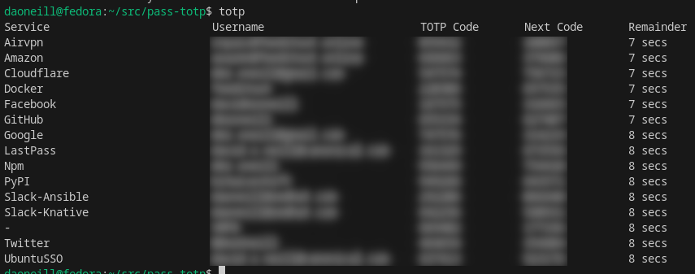
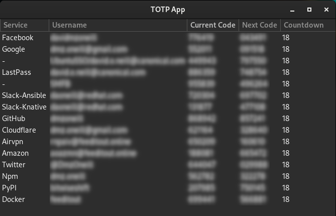

# Passmate

Combined GNU Pass password manager and TOTP authenticator for GNOME Shell.

Browse your password store and copy TOTP codes from a single panel indicator with tabbed navigation. Also includes standalone CLI and GUI tools for viewing TOTP codes outside GNOME Shell.


## Features

- **Tabbed UI** with segmented control — switch between Passwords and TOTP
- **Password browser** — navigate your `~/.password-store` directory tree, click to copy
- **TOTP codes** — async generation via `oathtool`, 30-second auto-refresh, click to copy
- **Fuzzy search** with Levenshtein distance matching and 300ms debounce
- **Fully async** — no UI blocking, loading spinners while data fetches
- **Clipboard auto-clear** — configurable timeout (default 45 seconds)
- **Keyboard shortcut** — `Super+W` to open (configurable)
- **Preferences UI** — default tab, clipboard timeout, TOTP entry name, store path

## CLI & GUI Tools

In addition to the GNOME Shell extension, passmate includes standalone tools for viewing TOTP codes:

### `totp` — Static terminal output

Prints all TOTP codes in a formatted table with service, username, current code, next code, and time remaining.

```bash
./totp
```



### `ctotp` — Interactive curses TUI

Live-updating terminal UI with automatic refresh every 30 seconds. Codes update in place.

```bash
./ctotp
```


### `gtotp` — GTK4 desktop application

Graphical TOTP viewer with click-to-copy. Uses PyGTK4.

```bash
./gtotp
```



### `sync` — Authy migration tool

Synchronizes TOTP secrets from an Authy export into your GNU Pass `totp/all` entry. Merges new entries while preserving existing ones, using secret comparison to avoid duplicates.

```bash
AUTHY_EXPORT_PASSWORD=yourpass ./sync
```

### Linking tools to PATH

```bash
sudo ln -s $PWD/totp /usr/local/bin/totp
sudo ln -s $PWD/ctotp /usr/local/bin/ctotp
sudo ln -s $PWD/gtotp /usr/local/bin/gtotp
sudo ln -s $PWD/sync /usr/local/bin/totp-sync
```

## Supersedes

This project replaces and combines two earlier projects, which are now archived:

- **[authy-gnupass-totp](https://github.com/dmzoneill/authy-gnupass-totp)** — TOTP code viewer (archived)
- **[pass-gnome-extension](https://github.com/dmzoneill/pass-gnome-extension)** — Password store browser (archived)

## Requirements

- GNOME Shell 46+ (for the extension)
- [GNU Pass](https://www.passwordstore.org/) (`pass`)
- [oathtool](https://www.nongnu.org/oath-toolkit/) (for TOTP generation)
- Python 3 (for `ctotp` and `gtotp`)
- PyGTK4 (for `gtotp`)
- TOTP secrets stored in a pass entry (default `totp/all`) as `otpauth://` URIs

## Install

### GNOME Shell Extension

```bash
git clone https://github.com/dmzoneill/passmate.git
cd passmate
make install
```

Then restart GNOME Shell:
- **X11:** `Alt+F2`, type `r`, Enter
- **Wayland:** Log out and log back in

Enable via GNOME Extensions app or:
```bash
gnome-extensions enable passmate@dmzoneill.com
```

## Development

```bash
make dev          # Symlink + launch devkit session for testing
make dev-no-ext   # Launch devkit without extensions (baseline)
make install      # Copy to ~/.local/share/gnome-shell/extensions/
make uninstall    # Remove extension
make schemas      # Compile GSettings schemas
make lint         # Run eslint
make clean        # Remove compiled schemas
```

## Configuration

Open preferences via the gear icon in the extension popup, or:

```bash
gnome-extensions prefs passmate@dmzoneill.com
```

| Setting | Default | Description |
|---------|---------|-------------|
| Default tab | Passwords | Which tab opens first |
| Clipboard timeout | 45s | Auto-clear clipboard (0 = disabled) |
| TOTP pass entry | `totp/all` | Pass entry containing otpauth:// URIs |
| Password store path | *(empty)* | Custom path (falls back to `$PASSWORD_STORE_DIR` or `~/.password-store`) |
| Keybinding | `Super+W` | Keyboard shortcut to open menu |

## TOTP Entry Format

Store your TOTP secrets in a GNU Pass entry (default `totp/all`):

```
otpauth://totp/GitHub:username?secret=BASE32SECRET&digits=6
otpauth://totp/Google:user@gmail.com?secret=BASE32SECRET&digits=6
otpauth://totp/AWS:account-id?secret=BASE32SECRET&digits=8
```

## Testing

```bash
make test         # Run all test suites (bash + python)
```

Individual test suites are in `tests/`.

## License

Apache License 2.0 — see [LICENSE](LICENSE).
